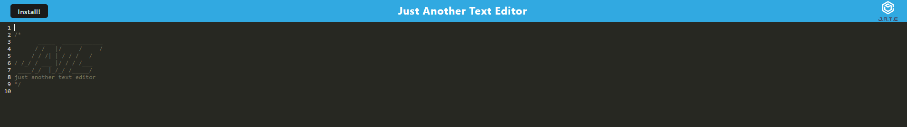

# Lucas-Saaler-JATE

## Description

This application allows users to edit text in a browser-based javascript text editor.

## Table of Contents

- [License](#license)
- [Installation](#installation)
- [Usage](#usage)
- [Credits](#credits)

## License

## Installation

After you download this file, run "npm i" in your terminal to install the required libraries (this may take a few minutes depending on your hardware speed). Once you have done that, run "npm run build" in your terminal. After that finishes, use "npm start" to start the application.

## Usage

When you have the website pulled up, simply type in the text editor to edit your text. When you click out of the editor, any changes you make will be automatically saved. When you revisit the website, any text you have saved will be auto-populated in the text editor. After visiting this website for the first time, you will be able to re-visit it without internet on the same browser, and it will continue to work normally, even despite the lack of internet connection.

Additionally, you may click the install button in the header or the download button in the URL bar to download this website as an app.

Deployed website found here: https://lsaa-jate.herokuapp.com/

## Credits

The starter code for this application was provided by the Ohio State University coding bootcamp. I wrote the rest of this code myself using Webpack, Javascript, Express, and Workbox.